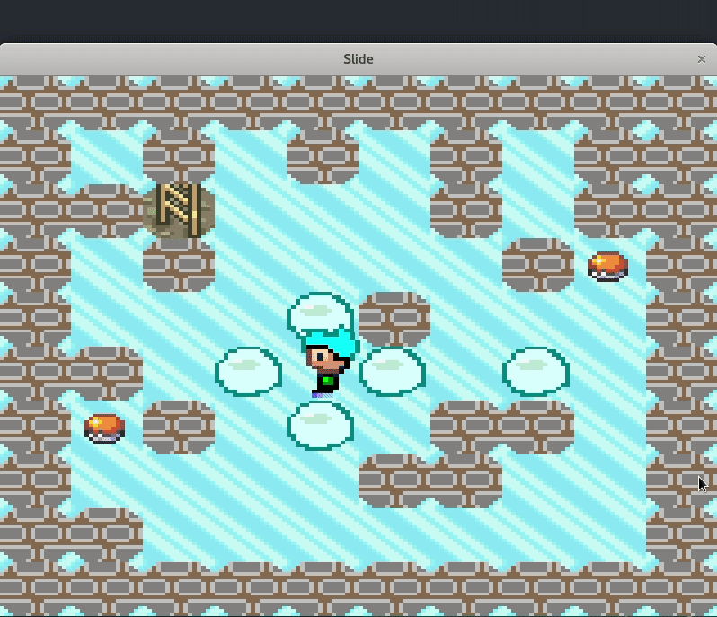

# Slide

Slide is a platform 2D java game.

Made during our student years with a friend, Slide was an extra-curricular project.
We enjoyed building it and apply our new Oriented Object knowledge.

The game includes around twelve levels, among with created sprites and design!

## How to play it
Download and run [Slide.jar](https://github.com/ymougenel/slide/raw/develop/Side.jar)

## Development

Just load the project on an IDE and launch the src/slide/Slide.java class.

You can build the jar through the src/Makefile

This diagram represent the game structure:

## Thanks to

Arcady, which whom I spent a great time developing the game.
All the people who tried it, gave feedback, and mostly enjoyed it!

